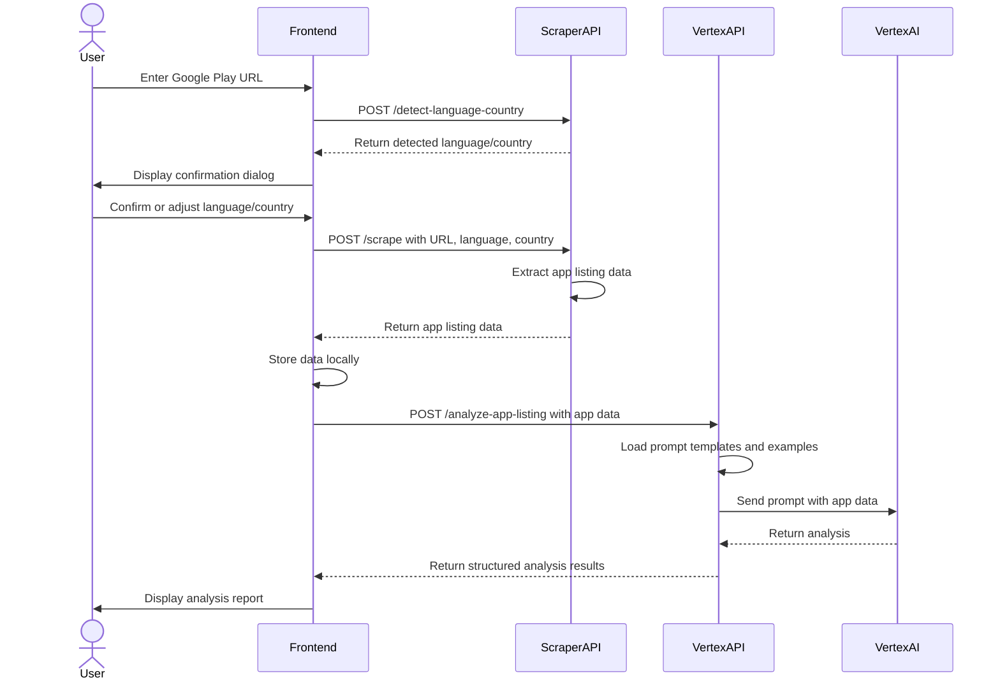

# App Localization Audit Tool

A tool for analyzing and improving the localization quality of Google Play app listings using AI.

## Overview

The App Localization Audit Tool helps developers improve their Google Play app listings for global markets by analyzing localization quality. It provides detailed feedback on content quality, language quality, and visual elements to help make app listings more effective for international audiences.

## Features

- Google-like Material Design UI
- URL input form for Google Play app listings
- Language and country detection and confirmation
- Comprehensive app listing data extraction
- AI-powered localization quality analysis
- Detailed audit results with categorized findings
- Tabbed interface for different aspects of localization quality

## Architecture

The application consists of three main components:

1. **Frontend (Next.js)**: User interface for submitting Google Play app URLs and viewing analysis results
2. **Scraper API (FastAPI)**: Service for extracting data from Google Play app listings
3. **Vertex AI API (FastAPI)**: Service for analyzing app listing data using Google Cloud Vertex AI (Gemini)

### System Flow



## Project Structure

```
localizing-ai/
├── memory-bank/           # Project documentation
├── src/
│   ├── api/               # Vertex AI API service
│   │   ├── main.py        # FastAPI application
│   │   ├── vertex_libs.py # Vertex AI client library
│   │   └── ...
│   ├── frontend/          # Next.js frontend application
│   │   ├── src/
│   │   │   ├── app/       # Next.js App Router pages
│   │   │   ├── components/# React components
│   │   │   ├── services/  # API services
│   │   │   └── theme/     # Material UI theme
│   │   └── ...
│   ├── prompts/           # Prompt templates and examples
│   │   ├── examples/      # Good and bad localization examples
│   │   ├── prompt_templates/ # Templates for AI analysis
│   │   └── ...
│   └── scraper/           # Scraper API service
│       ├── main.py        # FastAPI application
│       └── ...
└── ...
```

## User Flow

1. **URL Submission**:
   - User opens the frontend application
   - User pastes a Google Play app listing URL in the form
   - Frontend validates the URL format
   - Frontend sends the URL to the Scraper API for language/country detection

2. **Language/Country Confirmation**:
   - Scraper API detects the language and country from the URL
   - Frontend displays a confirmation dialog with the detected language and country
   - User can confirm or adjust the language and country settings
   - Upon confirmation, the frontend navigates to the results page

3. **App Listing Scraping**:
   - Scraper API extracts comprehensive data from the Google Play listing
   - Data is returned to the frontend and stored locally

4. **Analysis with Vertex AI**:
   - Frontend sends the scraped data to the Vertex AI API
   - Vertex AI API uses prompt templates and examples to analyze the data
   - Analysis is performed in the language specified during scraping
   - Results are returned to the frontend in a structured format

5. **Report Display**:
   - Frontend displays the analysis results in a tabbed interface
   - Results are categorized into Content Quality, Language Quality, and Visual Elements
   - Each category shows detailed assessments with status, evidence, and explanations

## Getting Started

### Prerequisites

- Node.js (v18 or later)
- Python 3.8+
- Google Cloud account with Vertex AI API access

### Installation and Setup

#### 1. Clone the repository

```bash
git clone https://github.com/yourusername/localizing-ai.git
cd localizing-ai
```

#### 2. Set up the Vertex AI API

```bash
cd src/api
python -m venv venv
source venv/bin/activate  # On Windows: venv\Scripts\activate
pip install -r requirements.txt
```

Create a `.env` file in the `src/api` directory:

```
GCP_PROJECT=your-gcp-project-id
```

#### 3. Set up the Scraper API

```bash
cd src/scraper
python -m venv venv
source venv/bin/activate  # On Windows: venv\Scripts\activate
pip install -r requirements.txt
playwright install chromium
```

#### 4. Set up the Frontend

```bash
cd src/frontend
npm install
```

Create a `.env.local` file in the `src/frontend` directory:

```
NEXT_PUBLIC_VERTEX_API_URL=http://localhost:8000
NEXT_PUBLIC_SCRAPER_API_URL=http://localhost:8001
NEXT_PUBLIC_APP_NAME=App Localization Audit Tool
```

### Running the Application

#### 1. Start the Vertex AI API

```bash
cd src/api
source venv/bin/activate  # On Windows: venv\Scripts\activate
uvicorn main:app --reload --port 8000
```

#### 2. Start the Scraper API

```bash
cd src/scraper
source venv/bin/activate  # On Windows: venv\Scripts\activate
uvicorn main:app --reload --port 8001
```

#### 3. Start the Frontend

```bash
cd src/frontend
npm run dev
```

#### 4. Access the Application

Open [http://localhost:3000](http://localhost:3000) in your browser.

## Contributing

Contributions are welcome! Please feel free to submit a Pull Request.

## License

This project is licensed under the Apache License 2.0 - see the LICENSE file for details.
