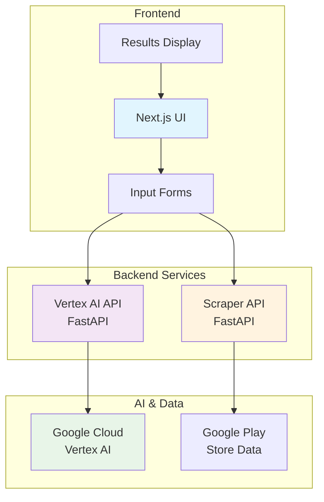
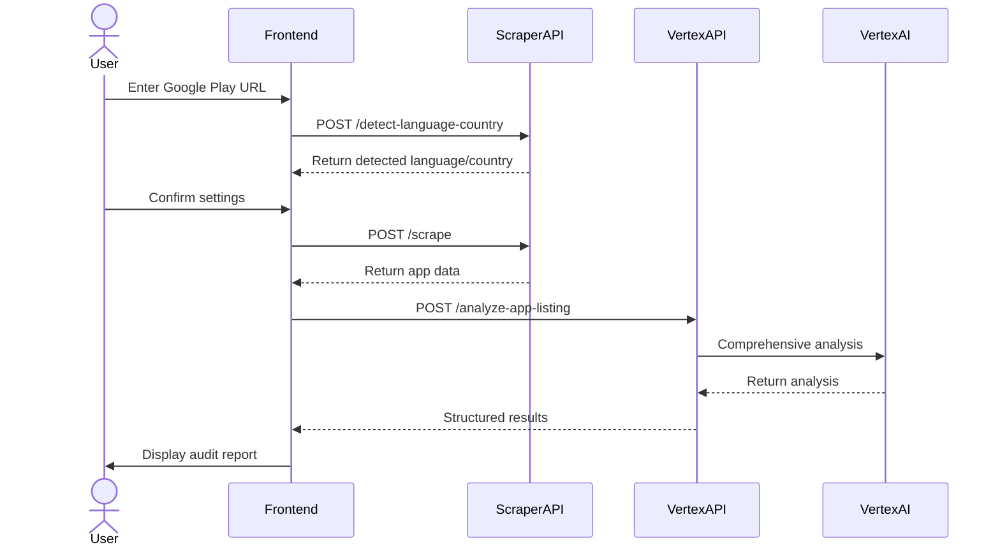
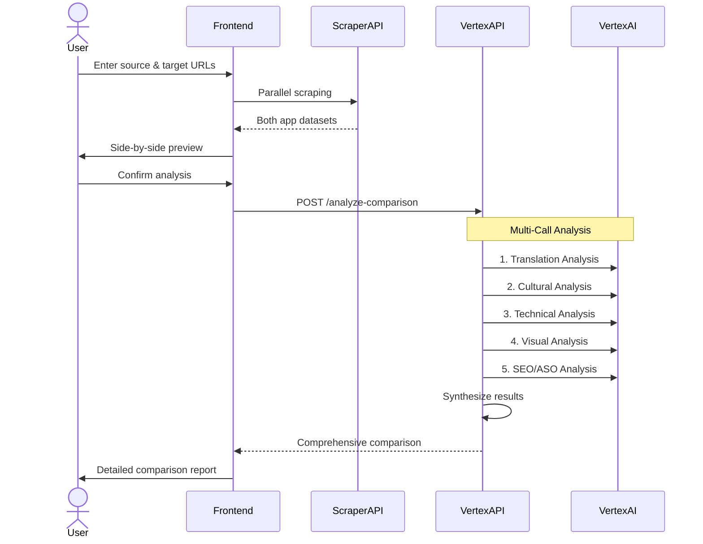

# App Localization Audit Tool

A comprehensive AI-powered tool for analyzing and improving the localization quality of Google Play app listings. Features both individual app analysis and side-by-side comparison capabilities for source vs. target market evaluation.

## 🚀 Features

### Individual App Analysis
- **Comprehensive Localization Audit**: Analyze any Google Play app listing for localization quality
- **Multi-Dimensional Evaluation**: Content quality, language quality, and visual elements assessment
- **AI-Powered Insights**: Uses Google Cloud Vertex AI (Gemini models) for detailed analysis
- **Actionable Recommendations**: Prioritized suggestions for improvement

### Side-by-Side Comparison (Advanced)
- **Dual Market Analysis**: Compare source app listing with its localized version
- **Specialized Analysis Engine**: Multi-call architecture for deeper insights
  - Translation completeness and quality assessment
  - Cultural adaptation evaluation
  - Technical localization compliance
  - Visual localization comparison
  - SEO/ASO optimization analysis
- **Comparative Scoring**: Overall localization maturity scoring (Basic/Intermediate/Advanced)
- **Prioritized Action Plan**: Ranked recommendations based on impact and effort

### User Experience
- **Google Material Design**: Professional, intuitive interface
- **Real-time Processing**: Live app data extraction and analysis
- **Structured Results**: Tabbed interface organizing findings by category
- **Preview Mode**: Side-by-side app listing preview before analysis

## 🏗️ Architecture

The application follows a microservices architecture with three main components:



### Component Details

1. **Frontend (Next.js + TypeScript)**
   - Modern React-based application with App Router
   - Material UI design system
   - Real-time form validation and user feedback
   - Responsive design for desktop and mobile

2. **Scraper API (FastAPI)**
   - Extracts comprehensive data from Google Play listings
   - Language and country detection
   - Handles rate limiting and error recovery
   - Returns structured app listing data

3. **Vertex AI API (FastAPI)**
   - Interfaces with Google Cloud Vertex AI
   - Multi-prompt template system for specialized analysis
   - Handles both single app and comparison analysis
   - Advanced response parsing and fallback handling

## 📊 Analysis Capabilities

### Individual App Analysis
- **Content Quality**: Title effectiveness, description formatting, developer responses
- **Language Quality**: Native language assessment, translation completeness, grammar/spelling
- **Visual Elements**: Screenshot presence, UI clarity, graphics readability

### Comparison Analysis (Multi-Call Architecture)
1. **Translation Analysis**: Completeness and quality assessment
2. **Cultural Adaptation**: Local market appropriateness and cultural sensitivity
3. **Technical Localization**: Date/time formats, currency, number formats
4. **Visual Localization**: Screenshots, graphics, and UI element localization
5. **SEO/ASO Optimization**: Keyword optimization and character utilization
6. **Synthesis**: Combined scoring and prioritized recommendations

## 🚦 User Flow

### Single App Analysis


### Side-by-Side Comparison


## 📁 Project Structure

```
localizing-ai/
├── memory-bank/                    # Project documentation & context
├── src/
│   ├── api/                       # Vertex AI API service
│   │   ├── main.py               # FastAPI application
│   │   ├── vertex_libs.py        # Vertex AI client library
│   │   ├── requirements.txt      # Python dependencies
│   │   └── Dockerfile            # Container configuration
│   ├── frontend/                 # Next.js frontend application
│   │   ├── src/
│   │   │   ├── app/             # Next.js App Router pages
│   │   │   │   ├── page.tsx     # Main landing page
│   │   │   │   ├── preview/     # Single app preview
│   │   │   │   ├── results/     # Single app results
│   │   │   │   ├── comparison-preview/  # Side-by-side preview
│   │   │   │   └── comparison-results/  # Comparison results
│   │   │   ├── components/      # Reusable React components
│   │   │   │   ├── forms/       # Input forms
│   │   │   │   ├── layout/      # Layout components
│   │   │   │   └── ...
│   │   │   ├── services/        # API integration services
│   │   │   └── theme/           # Material UI theming
│   │   ├── package.json         # Node.js dependencies
│   │   └── Dockerfile           # Container configuration
│   ├── prompts/                 # AI prompt templates & examples
│   │   ├── examples/            # Good/bad localization examples
│   │   ├── prompt_templates/    # Specialized analysis templates
│   │   │   ├── comprehensive_audit.md           # Single app analysis
│   │   │   ├── comparison_translation_analysis.md
│   │   │   ├── comparison_cultural_analysis.md
│   │   │   ├── comparison_technical_analysis.md
│   │   │   ├── comparison_visual_analysis.md
│   │   │   └── comparison_seo_aso_analysis.md
│   │   └── localization_criteria.md
│   └── scraper/                 # Scraper API service
│       ├── main.py             # FastAPI application
│       ├── requirements.txt    # Python dependencies
│       └── Dockerfile          # Container configuration
├── deploy-to-cloudrun.sh       # Cloud deployment script
├── DEPLOYMENT.md               # Deployment documentation
└── README.md                   # This file
```

## 🛠️ Getting Started

### Prerequisites

- **Node.js** (v18 or later)
- **Python** 3.8+
- **Google Cloud Account** with Vertex AI API access
- **Git** for version control

### Quick Start

#### 1. Clone and Setup

```bash
git clone https://github.com/yourusername/localizing-ai.git
cd localizing-ai
```

#### 2. Google Cloud Configuration

```bash
# Install Google Cloud CLI (if not already installed)
# Follow: https://cloud.google.com/sdk/docs/install

# Authenticate with Google Cloud
gcloud auth application-default login

# Set your project
export GCP_PROJECT=your-gcp-project-id
gcloud config set project $GCP_PROJECT

# Enable required APIs
gcloud services enable aiplatform.googleapis.com
```

#### 3. Backend Setup

**Vertex AI API:**
```bash
cd src/api
python -m venv venv
source venv/bin/activate  # Windows: venv\Scripts\activate
pip install -r requirements.txt

# Create environment file
echo "GCP_PROJECT=$GCP_PROJECT" > .env.local
```

**Scraper API:**
```bash
cd src/scraper
python -m venv venv
source venv/bin/activate  # Windows: venv\Scripts\activate
pip install -r requirements.txt

# Install browser for scraping
playwright install chromium
```

#### 4. Frontend Setup

```bash
cd src/frontend
npm install

# Create environment file
cat > .env.local << EOF
NEXT_PUBLIC_VERTEX_API_URL=http://localhost:8000
NEXT_PUBLIC_SCRAPER_API_URL=http://localhost:8001
NEXT_PUBLIC_APP_NAME=App Localization Audit Tool
EOF
```

### Running Locally

Start all services in separate terminals:

```bash
# Terminal 1: Vertex AI API
cd src/api
source venv/bin/activate
uvicorn main:app --reload --port 8000

# Terminal 2: Scraper API  
cd src/scraper
source venv/bin/activate
uvicorn main:app --reload --port 8001

# Terminal 3: Frontend
cd src/frontend
npm run dev
```

**Access the application**: [http://localhost:3000](http://localhost:3000)

## 🚀 Deployment

### Google Cloud Run (Recommended)

Deploy all services to Google Cloud Run using the provided script:

```bash
# Make deployment script executable
chmod +x deploy-to-cloudrun.sh

# Deploy all services
./deploy-to-cloudrun.sh

# Or deploy individual services
gcloud run deploy vertex-api --source src/api --region us-central1
gcloud run deploy scraper-api --source src/scraper --region us-central1
gcloud run deploy frontend --source src/frontend --region us-central1
```

For detailed deployment instructions, see [DEPLOYMENT.md](DEPLOYMENT.md).

### Docker Compose (Local)

```bash
# Build and run all services
docker-compose up --build

# Access at http://localhost:3000
```

## 🔧 API Endpoints

### Scraper API (Port 8001)
- `POST /detect-language-country` - Detect language/country from URL
- `POST /scrape` - Extract app listing data
- `GET /health` - Health check

### Vertex AI API (Port 8000)
- `POST /analyze-app-listing` - Single app analysis
- `POST /analyze-comparison` - Side-by-side comparison analysis
- `POST /analyze` - Generic AI analysis
- `GET /health` - Health check

## 📋 Usage Examples

### Single App Analysis
1. Open the application
2. Select "Single App Analysis"
3. Paste a Google Play URL (e.g., `https://play.google.com/store/apps/details?id=com.example.app&hl=en&gl=US`)
4. Confirm detected language/country
5. View comprehensive analysis results

### Side-by-Side Comparison
1. Open the application
2. Select "Compare Apps"
3. Enter source app URL (original market)
4. Enter target app URL (localized market)
5. Preview both listings side-by-side
6. View detailed comparison analysis

## 🤝 Contributing

We welcome contributions! Please follow these steps:

1. **Fork the repository**
2. **Create a feature branch** (`git checkout -b feature/amazing-feature`)
3. **Make your changes** following the existing code style
4. **Add tests** for new functionality
5. **Commit your changes** (`git commit -m 'Add amazing feature'`)
6. **Push to the branch** (`git push origin feature/amazing-feature`)
7. **Open a Pull Request**

### Development Guidelines

- Follow TypeScript/Python best practices
- Add appropriate error handling
- Update documentation for new features
- Test both single and comparison analysis flows
- Ensure responsive design for frontend changes

## 📈 Roadmap

### Planned Features
- **Export Functionality**: PDF and CSV report exports
- **Historical Tracking**: Track localization improvements over time
- **Batch Analysis**: Analyze multiple apps simultaneously
- **Advanced Filtering**: Filter results by category, severity, etc.
- **API Integration**: Webhook support for CI/CD pipelines
- **Multi-Platform Support**: Apple App Store analysis

### Performance Improvements
- **Caching Layer**: Redis caching for frequent analyses
- **Background Processing**: Queue system for large analyses
- **CDN Integration**: Asset optimization and delivery
- **Database Storage**: Persistent storage for results and history

## 🐛 Troubleshooting

### Common Issues

**API not starting:**
```bash
# Check environment variables
echo $GCP_PROJECT

# Verify authentication
gcloud auth list

# Check API is enabled
gcloud services list --enabled | grep aiplatform
```

**Scraper issues:**
```bash
# Reinstall browser
playwright install chromium --force

# Check network connectivity to play.google.com
curl -I https://play.google.com
```

**Frontend build errors:**
```bash
# Clear cache and reinstall
rm -rf node_modules package-lock.json
npm install

# Check environment variables
cat src/frontend/.env.local
```

## 📄 License

This project is licensed under the Apache License 2.0 - see the [LICENSE](LICENSE) file for details.

## 🙏 Acknowledgments

- **Google Cloud Vertex AI** for powerful AI analysis capabilities
- **Material UI** for the beautiful design system
- **Next.js** and **FastAPI** for excellent developer experience
- **Playwright** for reliable web scraping capabilities

---

Built with ❤️ for the global app development community. Help make apps accessible and culturally appropriate worldwide!
