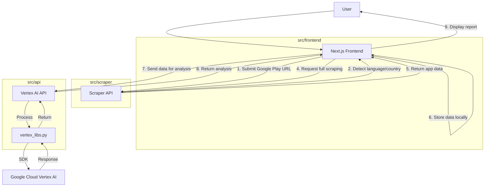
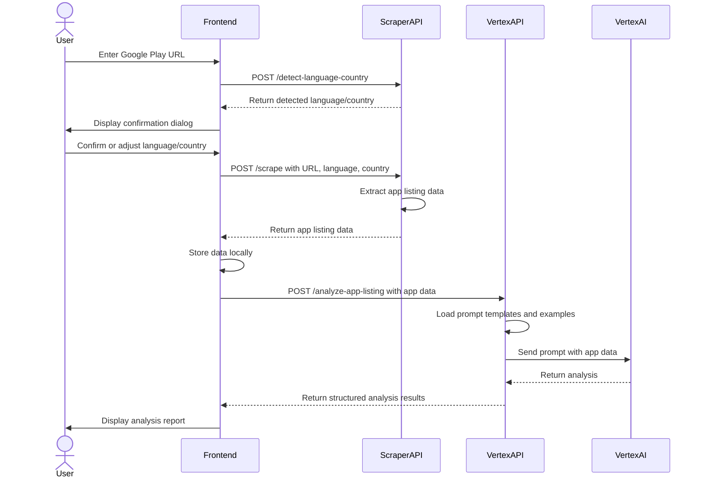
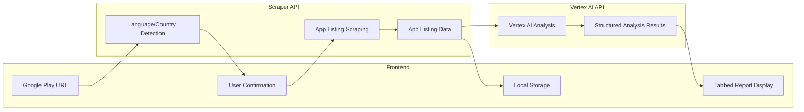

# System Patterns

*This document describes the high-level architecture, technical decisions, and patterns.*

## Architecture Overview

The App Localization Audit Tool consists of three main components:

1. **Frontend (Next.js)**: User interface for submitting Google Play app URLs and viewing analysis results
2. **Scraper API (FastAPI)**: Service for extracting data from Google Play app listings
3. **Vertex AI API (FastAPI)**: Service for analyzing app listing data using Google Cloud Vertex AI (Gemini)

### System Architecture Diagram



### Sequence Diagram



### Component Interaction Diagram

```mermaid
graph TD
    subgraph "User Interface"
        A[Home Page] --> B[URL Input Form]
        A --> C[Language/Country Dialog]
        D[Results Page] --> E[Tabbed Interface]
        E --> F[Content Quality Tab]
        E --> G[Language Quality Tab]
        E --> H[Visual Elements Tab]
    end
    
    subgraph "Frontend Services"
        I[API Service] --> J[detectLanguageCountry]
        I --> K[scrapeAppListing]
        I --> L[analyzeAppUrl]
    end
    
    subgraph "Backend APIs"
        M[Scraper API] --> N[/detect-language-country]
        M --> O[/scrape]
        P[Vertex AI API] --> Q[/analyze-app-listing]
        Q --> R[Prompt Templates]
        Q --> S[Examples]
    end
    
    B -- URL --> J
    C -- Confirmed Settings --> K
    K -- App Data --> L
    J -- API Call --> N
    K -- API Call --> O
    L -- API Call --> Q
    D -- Display Results --> E
```

### Data Flow Diagram



## User Flow

1. **URL Submission**:
   - User opens the frontend application
   - User pastes a Google Play app listing URL in the form
   - Frontend validates the URL format (must be a valid Google Play Store URL)
   - Frontend sends the URL to the Scraper API's `/detect-language-country` endpoint

2. **Language/Country Detection and Confirmation**:
   - Scraper API extracts language and country codes from the URL parameters
   - If not found in URL, defaults to 'en' and 'US'
   - Frontend displays a confirmation dialog with the detected language and country
   - User can confirm or adjust the language and country settings from dropdown menus
   - Upon confirmation, the frontend navigates to the results page with URL, language, and country parameters

3. **App Listing Scraping**:
   - Results page loads and calls the `analyzeAppUrl` function in the API service
   - This function first calls the Scraper API's `/scrape` endpoint with the URL, language, and country
   - Scraper API uses Playwright to load the Google Play page and extract data
   - Comprehensive data extraction includes:
     - Basic app details (title, developer, icon, rating, reviews)
     - Descriptions (short and long)
     - Visual elements (screenshots, feature graphic)
     - Ratings distribution
     - App metadata (size, version, installs, content rating)
     - Developer information (email, website)
     - Privacy policy URL
     - In-app purchases details
     - App permissions
     - Supported devices and OS requirements
     - Update history
     - User reviews and developer responses
     - Similar apps
   - Data is returned to the frontend and stored locally

4. **Analysis with Vertex AI**:
   - Frontend sends the scraped data to the Vertex AI API's `/analyze-app-listing` endpoint
   - Vertex AI API loads prompt templates from `src/prompts/prompt_templates/`
   - API also loads examples of good practices and common issues for context
   - API constructs a comprehensive prompt with the app listing data
   - Prompt is sent to Google Cloud Vertex AI (Gemini) with a structured JSON schema
   - Analysis is performed in the language specified during scraping
   - Results are returned to the frontend in a structured format with:
     - Overall score
     - Executive summary
     - Strengths and areas for improvement
     - Detailed assessments for content quality, language quality, and visual elements
     - Prioritized recommendations

5. **Report Display**:
   - Frontend displays the analysis results in a tabbed interface
   - Results are categorized into Content Quality, Language Quality, and Visual Elements
   - Each category shows detailed assessments with status, evidence, and explanations
   - Status is visually indicated (Pass, Needs Improvement, Fail)
   - Overall score is prominently displayed

## Key Technical Decisions

-   **Microservices Architecture**: The application is divided into three separate services (frontend, scraper API, Vertex AI API) for better scalability and maintenance.
-   **Language/Country Detection**: The scraper API detects the language and country from the URL to ensure analysis is performed in the correct context.
-   **User Confirmation Step**: Users can confirm or adjust the detected language and country before proceeding with the analysis.
-   **Local Data Storage**: The frontend stores scraped data locally to reduce API calls and improve performance.
-   **Structured Prompt Templates**: Markdown-based prompt templates with placeholders for app data ensure consistent analysis.
-   **Example-Based Context**: Including examples of good practices and common issues improves the quality of AI analysis.
-   **JSON Schema Response**: Using a structured JSON schema for Vertex AI responses ensures consistent, parseable results.
-   **Fallback Mechanisms**: Mock data is used when APIs are unavailable to ensure the application remains functional.
-   **Material UI**: Google-like design for a familiar and intuitive user experience.
-   **Tabbed Interface**: Categorized results make it easier for users to understand different aspects of localization quality.

## Design Patterns

-   **Microservices Architecture**: The application is divided into separate services with specific responsibilities.
-   **Proxy Pattern**: The FastAPI applications act as proxies to external services (Google Play Store, Vertex AI).
-   **Service Layer**: API services encapsulate the logic for interacting with external services.
-   **Repository Pattern**: Data storage and retrieval logic is separated from business logic.
-   **Dependency Injection**: FastAPI's built-in dependency injection for managing resources.
-   **Strategy Pattern**: Different prompt templates can be used for different types of analysis.
-   **Template Method Pattern**: The analysis process follows a consistent template with customizable parts.
-   **Adapter Pattern**: Converting between different data formats (e.g., API responses to UI-friendly structures).
-   **Observer Pattern**: Components react to state changes (e.g., loading states, error states).
-   **Facade Pattern**: The API service provides a simplified interface to the complex backend services.

## Critical Implementation Paths

-   **Language/Country Detection**: Accurately detecting and confirming the language and country from the URL.
-   **Scraping Reliability**: Ensuring the scraper can reliably extract data from Google Play listings despite potential structure changes.
-   **Comprehensive Data Extraction**: Extracting detailed information from Google Play listings including ratings distribution, developer information, app permissions, etc.
-   **Prompt Engineering**: Creating effective prompt templates for Vertex AI to produce useful analysis.
-   **Structured Analysis Results**: Ensuring the analysis results are structured in a way that is easy to understand and actionable.
-   **Error Handling**: Robust error handling across all services to provide a smooth user experience.
-   **Performance Optimization**: Optimizing API calls and data storage to ensure responsive performance.
-   **Fallback Mechanisms**: Implementing fallback to mock data when APIs are unavailable to ensure the application remains functional.
