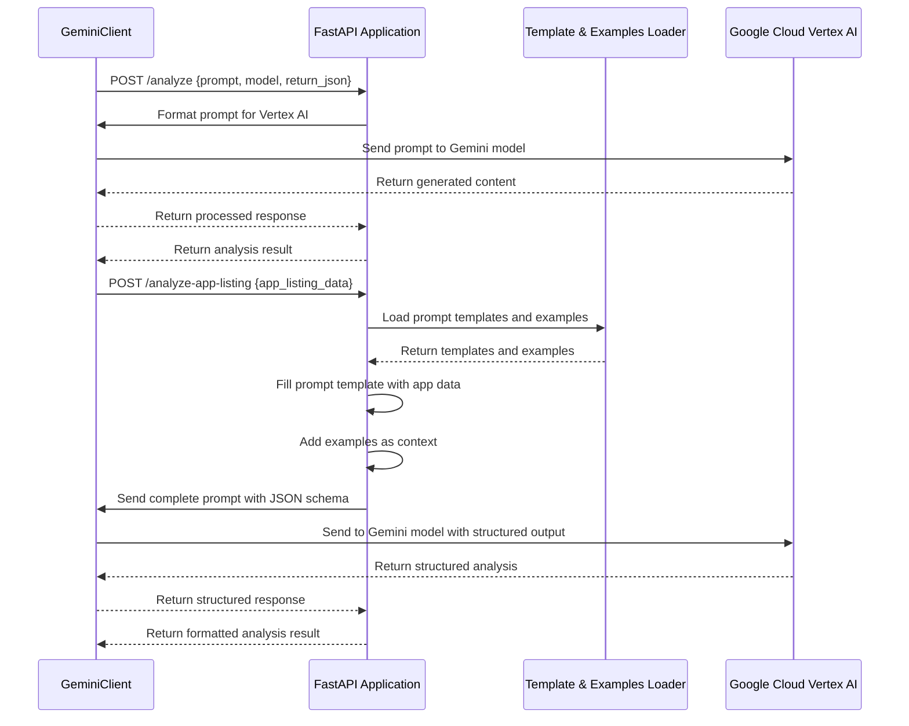

# Vertex AI API Architecture

This document describes the architecture and flow of the Vertex AI API component of the App Localization Audit Tool.

## Overview

The Vertex AI API is responsible for analyzing app listing data using Google Cloud Vertex AI (Gemini). It provides two main endpoints:

1. `/analyze` - Analyzes text content using Vertex AI
2. `/analyze-app-listing` - Analyzes Google Play app listing data for localization quality

## System Architecture

```mermaid
graph TD
    Client[Frontend Client] --> API[FastAPI Application]
    
    subgraph "Vertex AI API"
        API --> AnalyzeEndpoint[/analyze Endpoint]
        API --> AppListingEndpoint[/analyze-app-listing Endpoint]
        
        AnalyzeEndpoint --> GeminiClient[GeminiClient]
        AppListingEndpoint --> PromptLoader[Prompt Template Loader]
        AppListingEndpoint --> ExamplesLoader[Examples Loader]
        AppListingEndpoint --> GeminiClient
        
        PromptLoader --> PromptTemplates[(Prompt Templates)]
        ExamplesLoader --> Examples[(Examples)]
        
        GeminiClient --> VertexAI[Google Cloud Vertex AI]
    end
```

## Data Flow



## Component Details

### GeminiClient

A wrapper around the Google Cloud Vertex AI SDK that provides methods for interacting with Gemini models.

```python
class GeminiClient:
    def __init__(self, project_id=None, location="us-central1", logger=None):
        # Initialize the client with project ID and location
        # Set up logging
        
    async def generate_content_async(self, contents, model="gemini-1.5-flash-001", 
                                    return_json=False, json_schema=None, count_tokens=False):
        # Send content to Gemini model
        # Process and return the response
        # Optionally count tokens
        # Optionally request JSON response with schema
```

### Prompt Template Loader

Responsible for loading prompt templates from the file system.

```python
def load_prompt_template(template_name):
    # Load the prompt template from the file system
    # Handle file not found errors
    # Return the template content
```

### Examples Loader

Responsible for loading examples of good localization practices and common issues.

```python
def load_examples():
    # Load good examples and common issues
    # Handle file not found errors
    # Return the examples content
```

## API Endpoints

### 1. Analyze Content

```
POST /analyze
```

Request:
```json
{
  "prompt": "Analyze the following text for grammar issues: 'This is a example of text with grammar error.'",
  "model": "gemini-1.5-pro",
  "return_json": true,
  "count_tokens": false
}
```

Response:
```json
{
  "result": {
    "analysis": "The text contains a grammar error. It should be 'This is an example of text with a grammar error.'",
    "errors": [
      {
        "original": "This is a example",
        "correction": "This is an example",
        "explanation": "Use 'an' before words that begin with a vowel sound."
      },
      {
        "original": "text with grammar error",
        "correction": "text with a grammar error",
        "explanation": "The article 'a' is missing before 'grammar error'."
      }
    ]
  }
}
```

### 2. Analyze App Listing

```
POST /analyze-app-listing
```

Request:
```json
{
  "app_id": "com.example.app",
  "url": "https://play.google.com/store/apps/details?id=com.example.app",
  "language": "en",
  "country": "US",
  "title": "Example App",
  "developer": "Example Developer",
  "icon_url": "https://play-lh.googleusercontent.com/...",
  "short_description": "A short description of the app",
  "long_description": "A longer description of the app...",
  "screenshots": [
    {
      "url": "https://play-lh.googleusercontent.com/...",
      "alt_text": "Screenshot 1"
    }
  ],
  "model": "gemini-1.5-pro",
  "return_json": true,
  "count_tokens": false
}
```

Response:
```json
{
  "result": {
    "appTitle": "Example App",
    "appUrl": "https://play.google.com/store/apps/details?id=com.example.app",
    "score": 7.5,
    "contentQuality": {
      "titleCommunication": {
        "status": "Pass",
        "evidence": "Example App",
        "explanation": "The title clearly communicates the app purpose"
      },
      "shortDescription": {
        "status": "Needs Improvement",
        "evidence": "A short description of the app",
        "explanation": "The short description is too generic and lacks value proposition"
      }
    },
    "languageQuality": {
      "nativeLanguage": {
        "status": "Pass",
        "evidence": "Text appears natural and native",
        "explanation": "No awkward phrasing detected"
      }
    },
    "visualElements": {
      "screenshotPresence": {
        "status": "Pass",
        "evidence": "1 screenshot found",
        "explanation": "Screenshots are provided"
      }
    },
    "executiveSummary": "The app listing is generally well-localized but could be improved in some areas.",
    "strengths": [
      "Clear app title",
      "Native-sounding language"
    ],
    "areasForImprovement": [
      "Generic short description",
      "Limited screenshots"
    ],
    "prioritizedRecommendations": [
      "Improve the short description with more details and value proposition",
      "Add more screenshots showing different features"
    ]
  }
}
```

## Prompt Templates

The API uses several prompt templates for different types of analysis:

1. **Comprehensive Audit Template**: For full app listing analysis
2. **Text Analysis Template**: For analyzing text content only
3. **Visual Analysis Template**: For analyzing visual elements only

These templates are stored as Markdown files in the `src/prompts/prompt_templates/` directory.

## JSON Schema

The API uses a structured JSON schema to ensure consistent responses from Vertex AI:

```json
{
  "type": "OBJECT",
  "properties": {
    "appTitle": {"type": "STRING"},
    "appUrl": {"type": "STRING"},
    "score": {"type": "NUMBER"},
    "executiveSummary": {"type": "STRING"},
    "strengths": {"type": "ARRAY", "items": {"type": "STRING"}},
    "areasForImprovement": {"type": "ARRAY", "items": {"type": "STRING"}},
    "prioritizedRecommendations": {"type": "ARRAY", "items": {"type": "STRING"}},
    "contentQuality": {
      "type": "OBJECT",
      "properties": {
        "titleCommunication": {
          "type": "OBJECT",
          "properties": {
            "status": {"type": "STRING"},
            "evidence": {"type": "STRING"},
            "explanation": {"type": "STRING"}
          }
        },
        // Other content quality properties...
      }
    },
    "languageQuality": {
      "type": "OBJECT",
      "properties": {
        // Language quality properties...
      }
    },
    "visualElements": {
      "type": "OBJECT",
      "properties": {
        // Visual elements properties...
      }
    }
  }
}
```

## Error Handling

The API handles various error scenarios:

1. **Invalid Request**: Returns a 400 Bad Request error
2. **Vertex AI Unavailable**: Returns a 503 Service Unavailable error
3. **Prompt Template Not Found**: Returns a 500 Internal Server Error
4. **Vertex AI API Error**: Returns a 500 Internal Server Error with details

## Future Improvements

1. **Caching**: Implement caching for prompt templates and examples
2. **Model Selection**: Allow more fine-grained control over model selection
3. **Multilingual Support**: Enhance support for analyzing content in multiple languages
4. **Custom Prompt Templates**: Allow users to provide custom prompt templates
5. **Batch Processing**: Support batch processing of multiple app listings
6. **Feedback Loop**: Implement a feedback mechanism to improve analysis quality
