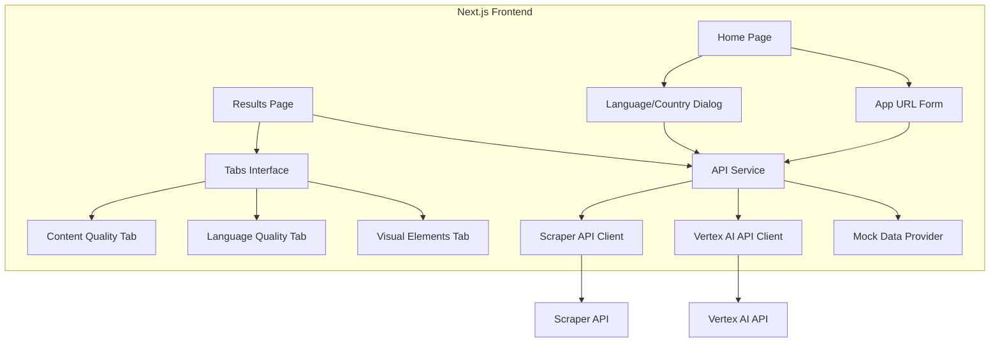
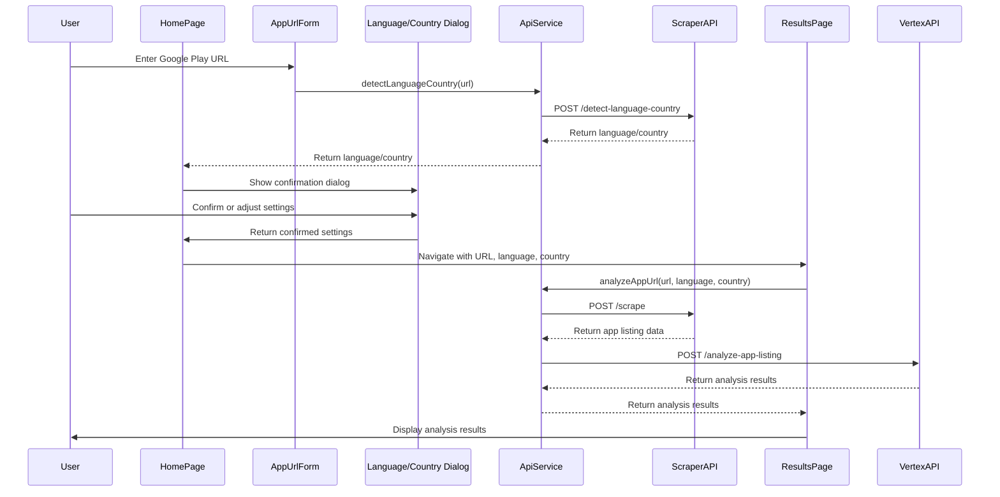

# Frontend Architecture

This document describes the architecture and flow of the Frontend component of the App Localization Audit Tool.

## Overview

The Frontend is a Next.js application that provides the user interface for the App Localization Audit Tool. It allows users to submit Google Play app URLs, confirm language and country settings, view app listing data, and see analysis results.

## System Architecture



## Component Structure

```mermaid
graph TD
    subgraph "Pages"
        HomePage[Home Page]
        ResultsPage[Results Page]
    end
    
    subgraph "Components"
        Layout[Layout]
        Header[Header]
        Footer[Footer]
        AppUrlForm[App URL Form]
        LanguageCountryDialog[Language/Country Dialog]
        TabPanel[Tab Panel]
        AssessmentCard[Assessment Card]
    end
    
    subgraph "Services"
        ApiService[API Service]
    end
    
    subgraph "Theme"
        ThemeRegistry[Theme Registry]
        Theme[Theme Configuration]
    end
    
    HomePage --> Layout
    ResultsPage --> Layout
    
    Layout --> Header
    Layout --> Footer
    
    HomePage --> AppUrlForm
    HomePage --> LanguageCountryDialog
    
    ResultsPage --> TabPanel
    TabPanel --> AssessmentCard
    
    AppUrlForm --> ApiService
    LanguageCountryDialog --> ApiService
    ResultsPage --> ApiService
    
    Layout --> ThemeRegistry
    ThemeRegistry --> Theme
```

## Data Flow



## Key Components

### Pages

#### Home Page (`src/app/page.tsx`)

The main landing page that contains the URL input form and language/country confirmation dialog.

```typescript
export default function Home() {
  // State for loading, error, dialog, language/country
  // Handle URL submission
  // Handle language/country confirmation
  // Navigate to results page
}
```

#### Results Page (`src/app/results/page.tsx`)

Displays the analysis results in a tabbed interface.

```typescript
export default function ResultsPage() {
  // Get URL, language, country from query parameters
  // Fetch analysis results
  // Display results in tabs
}
```

### Components

#### Layout Components

- **Layout** (`src/components/layout/Layout.tsx`): Main layout wrapper
- **Header** (`src/components/layout/Header.tsx`): App header with logo and navigation
- **Footer** (`src/components/layout/Footer.tsx`): App footer with links and information

#### Form Components

- **AppUrlForm** (`src/components/forms/AppUrlForm.tsx`): Form for submitting Google Play URLs

```typescript
export default function AppUrlForm({ onSubmit, isLoading, error }) {
  // URL state and validation
  // Handle form submission
  // Display validation errors
}
```

### Services

#### API Service (`src/services/api.ts`)

Handles communication with the backend APIs.

```typescript
export const apiService = {
  // Detect language and country from URL
  detectLanguageCountry: async (url) => {
    // Call Scraper API
    // Return language and country
  },
  
  // Scrape app listing data
  scrapeAppListing: async (url, language, country) => {
    // Call Scraper API
    // Return app listing data
  },
  
  // Analyze app URL
  analyzeAppUrl: async (url, language, country) => {
    // Scrape app listing
    // Send to Vertex AI API
    // Return analysis results
    // Fall back to mock data if needed
  }
};
```

### Theme

#### Theme Configuration (`src/theme/theme.ts`)

Defines the Material UI theme with Google-like styling.

```typescript
export const theme = createTheme({
  // Color palette
  // Typography
  // Component overrides
});
```

#### Theme Registry (`src/theme/ThemeRegistry.tsx`)

Provides the Material UI theme to the application.

```typescript
export default function ThemeRegistry({ children }) {
  // Set up Material UI theme
  // Provide theme to components
}
```

## User Flows

### URL Submission Flow

1. User enters a Google Play URL in the form
2. Frontend validates the URL format
3. Frontend sends the URL to the Scraper API for language/country detection
4. Frontend displays a confirmation dialog with the detected language and country
5. User confirms or adjusts the language and country settings
6. Frontend navigates to the results page with the URL, language, and country as query parameters

### Results Display Flow

1. Results page loads with URL, language, and country from query parameters
2. Results page calls the API service to analyze the app URL
3. API service scrapes the app listing data from the Scraper API
4. API service sends the app listing data to the Vertex AI API for analysis
5. API service returns the analysis results to the results page
6. Results page displays the analysis results in a tabbed interface

## Error Handling

The frontend implements several error handling strategies:

1. **URL Validation**: Validates the URL format before submission
2. **Loading States**: Shows loading indicators during API calls
3. **Error Messages**: Displays error messages when API calls fail
4. **Fallback to Mock Data**: Uses mock data when APIs are unavailable
5. **Retry Logic**: Retries failed API calls with exponential backoff

## Responsive Design

The frontend is designed to be responsive and work well on different screen sizes:

1. **Fluid Layouts**: Uses responsive grid layouts
2. **Breakpoints**: Adjusts layout based on screen size
3. **Mobile-First**: Designed with mobile users in mind
4. **Flexible Components**: Components adapt to available space

## Performance Optimization

Several performance optimizations are implemented:

1. **Local Data Storage**: Stores app listing data locally to reduce API calls
2. **Lazy Loading**: Loads components and data only when needed
3. **Memoization**: Caches expensive computations
4. **Code Splitting**: Splits code into smaller chunks
5. **Image Optimization**: Uses Next.js image optimization

## Future Improvements

1. **Authentication**: Add user authentication and history tracking
2. **Export Functionality**: Add export options for audit reports (PDF, CSV)
3. **Comparison View**: Implement before/after comparison for app listings
4. **Saved Reports**: Allow users to save and share reports
5. **Detailed Recommendations**: Add more detailed recommendations with examples
6. **Interactive Elements**: Add interactive elements to help users understand issues
7. **Localization**: Add support for multiple languages in the UI
