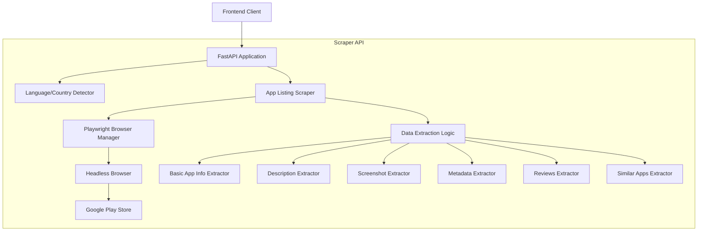
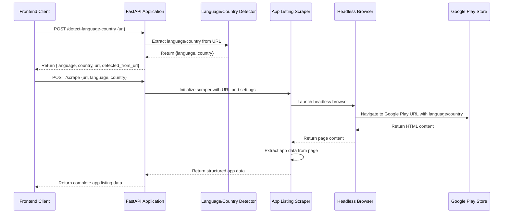

# Scraper API Architecture

This document describes the architecture and flow of the Scraper API component of the App Localization Audit Tool.

## Overview

The Scraper API is responsible for extracting data from Google Play app listings. It provides two main endpoints:

1. `/detect-language-country` - Detects the language and country from a Google Play URL
2. `/scrape` - Extracts comprehensive data from a Google Play app listing

## System Architecture



## Data Flow



## Component Details

### Language/Country Detector

Responsible for extracting language and country codes from Google Play URLs. If not found in the URL, it defaults to 'en' and 'US'.

```python
def detect_language_country(url: str) -> Dict[str, str]:
    # Extract language and country from URL parameters (hl and gl)
    # Example: https://play.google.com/store/apps/details?id=com.example.app&hl=fr&gl=FR
    # Return detected values or defaults
```

### App Listing Scraper

Responsible for extracting comprehensive data from Google Play app listings using Playwright.

```python
async def scrape_app_listing(url: str, language: str, country: str) -> Dict[str, Any]:
    # Launch Playwright browser
    # Navigate to URL with language and country parameters
    # Extract app data using selectors and parsing logic
    # Return structured app data
```

### Data Extraction Logic

Specialized extractors for different types of app listing data:

1. **Basic App Info Extractor**: Extracts title, developer, icon, rating, etc.
2. **Description Extractor**: Extracts short and long descriptions
3. **Screenshot Extractor**: Extracts screenshots and feature graphic
4. **Metadata Extractor**: Extracts app metadata (size, version, installs, etc.)
5. **Reviews Extractor**: Extracts user reviews and developer responses
6. **Similar Apps Extractor**: Extracts similar apps recommendations

## API Endpoints

### 1. Detect Language and Country

```
POST /detect-language-country
```

Request:
```json
{
  "url": "https://play.google.com/store/apps/details?id=com.example.app&hl=fr&gl=FR"
}
```

Response:
```json
{
  "language": "fr",
  "country": "FR",
  "url": "https://play.google.com/store/apps/details?id=com.example.app&hl=fr&gl=FR",
  "detected_from_url": true
}
```

### 2. Scrape App Listing

```
POST /scrape
```

Request:
```json
{
  "url": "https://play.google.com/store/apps/details?id=com.example.app",
  "language": "en",
  "country": "US"
}
```

Response:
```json
{
  "app_id": "com.example.app",
  "url": "https://play.google.com/store/apps/details?id=com.example.app",
  "language": "en",
  "country": "US",
  "title": "Example App",
  "developer": "Example Developer",
  "icon_url": "https://play-lh.googleusercontent.com/...",
  "category": "Productivity",
  "rating": 4.5,
  "reviews_count": 10000,
  "ratings_distribution": {
    "5": 7000,
    "4": 2000,
    "3": 500,
    "2": 300,
    "1": 200
  },
  "short_description": "A short description of the app",
  "long_description": "A longer description of the app...",
  "screenshots": [
    {
      "url": "https://play-lh.googleusercontent.com/...",
      "alt_text": "Screenshot 1"
    }
  ],
  "feature_graphic": "https://play-lh.googleusercontent.com/...",
  "last_updated": "April 1, 2025",
  "size": "15 MB",
  "installs": "1,000,000+",
  "version": "1.0.0",
  "content_rating": "Everyone",
  "price": "Free",
  "contains_ads": true,
  "in_app_purchases": true,
  "in_app_purchase_details": ["Item 1: $0.99", "Item 2: $1.99"],
  "developer_email": "example@example.com",
  "developer_website": "https://example.com",
  "privacy_policy_url": "https://example.com/privacy",
  "app_permissions": ["Camera", "Location", "Storage"],
  "supported_devices": ["Phone", "Tablet"],
  "min_os_version": "Android 8.0+",
  "update_history": [
    {
      "date": "April 1, 2025",
      "description": "Bug fixes and performance improvements"
    }
  ],
  "user_reviews": [
    {
      "author": "User 1",
      "rating": 5,
      "date": "March 15, 2025",
      "text": "Great app!"
    }
  ],
  "developer_responses": [
    {
      "date": "March 16, 2025",
      "text": "Thank you for your feedback!"
    }
  ],
  "similar_apps": [
    {
      "name": "Similar App 1",
      "url": "https://play.google.com/store/apps/details?id=com.example.similar1"
    }
  ]
}
```

## Error Handling

The API handles various error scenarios:

1. **Invalid URL**: Returns a 400 Bad Request error
2. **Scraping Failure**: Returns a 500 Internal Server Error with details
3. **Timeout**: Returns a 504 Gateway Timeout error if scraping takes too long
4. **Rate Limiting**: Returns a 429 Too Many Requests error if rate limits are exceeded

## Future Improvements

1. **Caching**: Implement caching to avoid repeated scraping of the same app
2. **Rate Limiting**: Add rate limiting to avoid overloading the Google Play Store
3. **Retry Mechanism**: Add retry logic for transient failures
4. **Proxy Support**: Add support for using proxies to avoid IP blocking
5. **Parallel Scraping**: Implement parallel scraping for faster data extraction
6. **Data Validation**: Add more robust data validation and error handling
